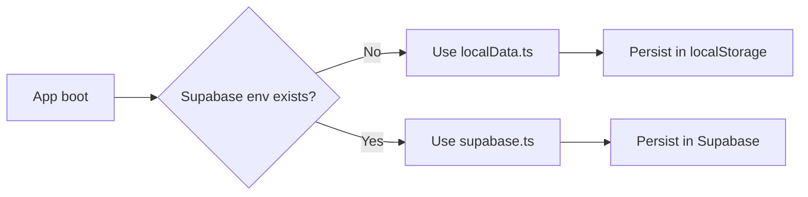

<div align="center">

# BillFlow

Polished Telegram Mini App portfolio project for subscription tracking, built with a 2026-style neon green dashboard, animated widgets, and offline-first persistence.

<p>
  
  
  
  
  
  
  
</p>

</div>

## Product Preview

<p align="center">
  
  
</p>

## What Makes This Portfolio Strong

- Full product flow, not a static landing page.
- Modern visual system with glass layers, gradients, and motion.
- Real interaction model: create, edit, pause, resume, and delete subscriptions.
- Dashboard widgets that react to current subscription data.
- Offline-first behavior for instant showcase without backend setup.
- Optional Supabase path preserved for production-like architecture.

## Feature Snapshot

| Area | Included |
|---|---|
| Dashboard | Spend momentum, renewal trend, health score, largest plan widgets |
| Subscriptions | Add, update status, delete with contextual actions |
| Analytics | Category and billing cycle chart views |
| UX | Search, filters, smooth transitions, loading skeletons |
| Data | Local persistence by default, Supabase-ready structure |
| Platform | Telegram Mini App launch + browser desktop preview |

## Data Strategy

BillFlow works out of the box in portfolio mode.

- Default mode: local persistence (`localStorage`).
- Supabase mode: enabled automatically when env keys are provided.
- You can force local mode with `VITE_FORCE_LOCAL_DATA=true`.



## Architecture Flow

1. Telegram context and launch behavior are initialized in `src/hooks/useTelegram.ts`.
2. Subscription operations are handled in `src/hooks/useSubscriptions.ts`.
3. Dashboard metrics and widget calculations are handled in `src/hooks/useDashboard.ts`.
4. Data mode is selected in `src/lib/dataMode.ts`.
5. Persistence implementations live in `src/lib/localData.ts` and `src/lib/supabase.ts`.

## Tech Stack

- React 18 + TypeScript
- Vite 5
- Tailwind CSS 3.4
- React Query
- React Hook Form + Zod
- Recharts
- Vitest + Playwright
- Telegram WebApp SDK

## Quick Start

```bash
npm install
npm run dev
```

Build for production:

```bash
npm run build
```

Run checks:

```bash
npm run lint
npm run typecheck
npm test -- --coverage
```

## Environment

Create `.env` from `.env.example`.

```bash
cp .env.example .env
```

PowerShell:

```powershell
Copy-Item .env.example .env
```

Available variables:

```env
VITE_SUPABASE_URL=
VITE_SUPABASE_ANON_KEY=
VITE_BOT_TOKEN=
VITE_FORCE_LOCAL_DATA=false
```

## Telegram Mini App Setup

1. Create a bot via [@BotFather](https://t.me/botfather).
2. Set your Web App URL to deployed app URL or local tunnel URL.
3. Open the bot and launch the mini app.
4. For portfolio demos, keep offline-first mode enabled.

## Scripts

- `npm run dev` - start local development server.
- `npm run build` - compile TypeScript and create `dist/`.
- `npm run preview` - preview production build.
- `npm run lint` - run ESLint.
- `npm run typecheck` - run TypeScript checks.
- `npm run test` - run unit tests with Vitest.
- `npm run test:e2e` - run Playwright e2e tests.

## Project Structure

```text
newminiapp/
  .github/workflows/
  e2e/
  src/
    components/
      layout/
      loading/
      ui/
    features/
      analytics/
      dashboard/
      subscriptions/
    hooks/
    lib/
    test/
    types/
  supabase/
    functions/
    migrations/
  gif1.gif
  gif2.gif
  README.md
```

## Notes

- `dist/`, `node_modules/`, and `coverage/` are excluded from Git.
- This repository is optimized for visual portfolio impact and product-level UX.
- Supabase integration is optional and can be connected later without restructuring.

## License

MIT
